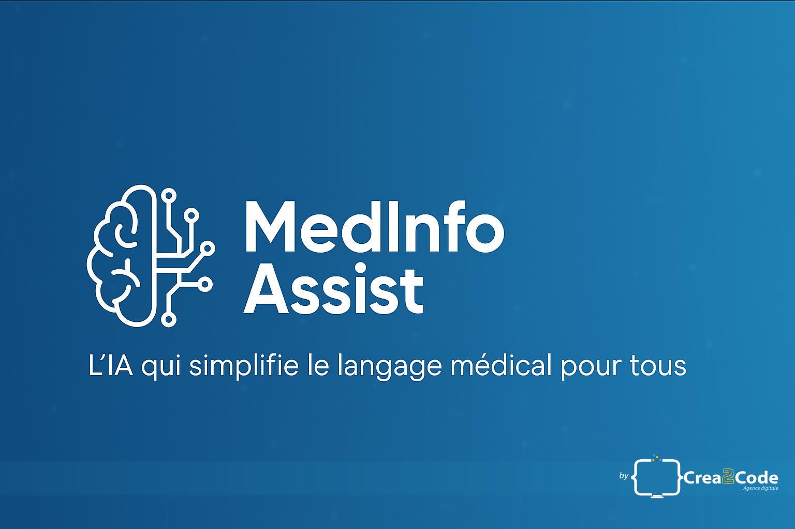

  

<h1 align="center">

<svg xmlns="http://www.w3.org/2000/svg" width="34" height="34" viewBox="0 0 24 24" fill="none" stroke="currentColor" stroke-width="2" stroke-linecap="round" stroke-linejoin="round" class="lucide lucide-brain-circuit w-16 h-16 text-blue-600 mb-4" aria-hidden="true"><path d="M12 5a3 3 0 1 0-5.997.125 4 4 0 0 0-2.526 5.77 4 4 0 0 0 .556 6.588A4 4 0 1 0 12 18Z"></path><path d="M9 13a4.5 4.5 0 0 0 3-4"></path><path d="M6.003 5.125A3 3 0 0 0 6.401 6.5"></path><path d="M3.477 10.896a4 4 0 0 1 .585-.396"></path><path d="M6 18a4 4 0 0 1-1.967-.516"></path><path d="M12 13h4"></path><path d="M12 18h6a2 2 0 0 1 2 2v1"></path><path d="M12 8h8"></path><path d="M16 8V5a2 2 0 0 1 2-2"></path><circle cx="16" cy="13" r=".5"></circle><circle cx="18" cy="3" r=".5"></circle><circle cx="20" cy="21" r=".5"></circle><circle cx="20" cy="8" r=".5"></circle></svg>  
MedInfo Assist
</h1>

  <b>L’IA qui simplifie le langage médical pour tous</b> 
  Développée par <a href="https://crea2code.fr" target="_blank">Sonia Chalal</a> | <b>Crea2Code</b> – Développeuse Full Stack & IA Web.

  
  
  
  
  

---

## 📋 Sommaire

- [🌟 Présentation](#-présentation)
- [🎨 Aperçu du design](#-aperçu-du-design)
- [🧩 Stack technique](#-stack-technique)
- [🚀 Installation et exécution](#-installation-et-exécution)
- [🧠 Fonctionnalités principales](#-fonctionnalités-principales)
- [🌍 Déploiement](#-déploiement)
- [🖋️ Auteur](#️-auteur)
- [⚖️ Licence](#-licence)

---

## 🌟 Présentation

**MedInfo Assist** est une application web de démonstration qui utilise l’IA pour :
- vulgariser les **termes médicaux complexes** en langage clair ;
- générer des **conseils de prévention santé personnalisés** ;
- montrer comment l’IA peut **soutenir la compréhension et la prévention médicale.**

> 🩺 Ce projet a été développé dans le cadre du **Forum Santé pour Tous 2025 – “IA et données de santé au service de l’innovation”** à Caen.

---

## 🎨 Aperçu du design

Interface claire, fluide et rassurante, inspirée des plateformes de santé modernes.  
Logo **BrainCircuit 🧠** : symbole de la synergie entre l’intelligence humaine et artificielle.

  <svg xmlns="http://www.w3.org/2000/svg" width="64" height="64" viewBox="0 0 24 24" fill="none" stroke="#2563eb" stroke-width="2" stroke-linecap="round" stroke-linejoin="round" aria-hidden="true"><path d="M12 5a3 3 0 1 0-5.997.125 4 4 0 0 0-2.526 5.77 4 4 0 0 0 .556 6.588A4 4 0 1 0 12 18Z"></path><path d="M9 13a4.5 4.5 0 0 0 3-4"></path><path d="M6.003 5.125A3 3 0 0 0 6.401 6.5"></path><path d="M3.477 10.896a4 4 0 0 1 .585-.396"></path><path d="M6 18a4 4 0 0 1-1.967-.516"></path><path d="M12 13h4"></path><path d="M12 18h6a2 2 0 0 1 2 2v1"></path><path d="M12 8h8"></path><path d="M16 8V5a2 2 0 0 1 2-2"></path><circle cx="16" cy="13" r=".5"></circle><circle cx="18" cy="3" r=".5"></circle><circle cx="20" cy="21" r=".5"></circle><circle cx="20" cy="8" r=".5"></circle></svg>

---

## 🧩 Stack technique

| Domaine        | Technologie / Outil              | Description                                  |
|----------------|----------------------------------|----------------------------------------------|
| **Frontend**   | Next.js 14 + TypeScript          | Interface utilisateur réactive et moderne    |
| **Design**     | TailwindCSS                      | Mise en page fluide, responsive et élégante  |
| **Backend**    | FastAPI (Python 3.13)            | API REST d’analyse et de conseil IA          |
| **IA**         | Groq (LLaMA3-70B)                | Modèle d’intelligence artificielle utilisé   |
| **UI/UX**      | Lucide Icons, React Markdown     | Icônes modernes & affichage stylisé du texte |
| **Versioning** | Git + GitHub                     | Gestion du code, PR et CI/CD via GH Actions  |

---

## 🚀 Installation et exécution

### ⚙️ Backend – FastAPI

cd backend
python -m venv venv
venv\Scripts\activate
pip install -r requirements.txt
uvicorn app.main:app --reload
📡 Serveur local : http://127.0.0.1:8000

💻 Frontend – Next.js
cd frontend
npm install
npm run dev

🌐 Application locale : http://localhost:3000

🧠 Fonctionnalités principales

🩺 Analyse IA des textes médicaux

💡 Conseils santé personnalisés

🧾 Affichage en Markdown clair et structuré

⚙️ Connexion directe Next.js ↔ FastAPI

🎬 Animation d’accueil (splash + son)

⚕️ Encadré informatif — “Ce texte est une vulgarisation à but informatif”

🌍 Déploiement

Frontend déployé via GitHub Pages
Backend hébergé via Render ou Railway

Lien public :
🔗 https://crea2code.github.io/medinfo-assist

🖋️ Auteur

👩‍💻 Sonia Chalal
Développeuse Full Stack & Fondatrice de Crea2Code.fr

📍 Rouen • France
💬 Passionnée par la pédagogie numérique, l’IA et la santé connectée.

Ce projet a été conçu dans un contexte d’apprentissage professionnel pour démontrer des compétences avancées en intégration IA & web full stack.

⚖️ Licence

Projet distribué sous licence MIT
© 2025 – Crea2Code | Sonia Chalal

  
 